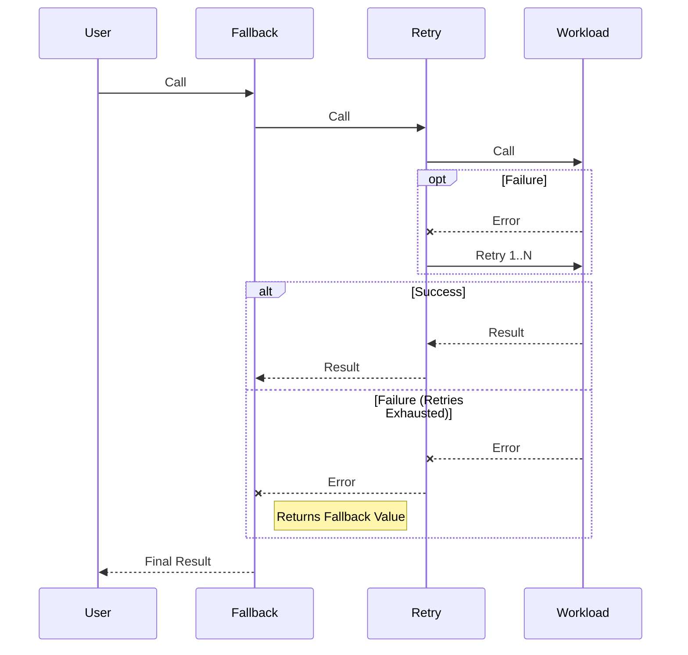

# `@metcoder95/fusebox`

> Utilitary library for applying resiliency workflows to protect workloads.

`fusebox` allows you to wrap functions (workloads) with protective patterns like **Retry**, **Fallback**, and **Circuit Breaker**. These patterns can be composed to build robust and resilient applications.

## Installation

```bash
npm install @metcoder95/fusebox
```

## Usage

The `FuseBox` class is the main entry point. Use it to compose workflows and wrap your target functions.

### Quick Start

```javascript
import { FuseBox, Workflows } from '@metcoder95/fusebox';

const fusebox = new FuseBox();

// A workload that simulates failure
const unstableWorkload = async () => {
  if (Math.random() > 0.5) throw new Error('Random connection failure');
  return 'Success!';
};

// 1. Configure the pipeline
// Order matters: workflows are added sequentially, wrapping the previous ones.
// Here: Fallback wraps Retry, which wraps the Workload.
// [Fallback] -> [Retry] -> [Workload]
const protectedWorkload = fusebox
  .addWorkflows(
    Workflows.Retry({
      retries: 3,
      delay: 100,
    }),
    Workflows.Fallback({
      value: 'Service unavailable, please try again later.',
    })
  )
  .protect(unstableWorkload);

// 2. Execute
const result = await protectedWorkload();
console.log(result);
```

## Workflow Composition

Workflows are applied in the order they are passed to `addWorkflows`. Each new workflow **wraps** the previously composed pipeline.

**Example:**

```javascript
fusebox.addWorkflows(Retry, Fallback);
```

Structure: `Fallback(Retry(Workload))`

Execution flow:

1.  **Fallback** starts.
2.  **Fallback** executes **Retry**.
3.  **Retry** executes the **Workload**.
4.  If **Workload** fails:
    - **Retry** intercepts the error and retries.
    - If retries perform successfully, **Fallback** receives success.
    - If retries are exhausted, **Retry** throws.
5.  **Fallback** catches the final error from **Retry** and provides the fallback value.



## Available Workflows

### Retry

Retries the workload upon failure.

```javascript
Workflows.Retry({
  retries: 3, // Max number of retries (default: 3)
  delay: 200, // Initial delay in ms (default: 200)
  backoff: 2, // Exponential backoff factor (default: 2)
  maxDelay: 10000, // Max delay cap in ms (default: 10000)
});
```

### Fallback

Provides a static value, or executes a function when the workflow fails.

```javascript
Workflows.Fallback({
  value: 'Backup Value', // Can be a value, a synchronous function, or a promise-returning function
  handleAbort: false, // If true, fallback is triggered even if the workload was aborted (default: false)
});
```

### Circuit Breaker

Prevents execution of a workload that is failing repeatedly, allowing the system to recover.

- **Closed**: Requests go through. Failures count towards the threshold.
- **Open**: Request fails immediately with an error. Stays open for `timeout` ms.
- **Half-Open**: Allows limited requests to test if the system recovered.

```javascript
Workflows.CircuitBreaker({
  attempts: 3,        // Con consecutive failures to open the circuit (default: 3)
  successAttempts: 1, // Consecutive successes needed to close the circuit (default: 1)
  timeout: 1000       // Duration the circuit stays Open before testing (default: 1000 ms)
  weight: 1       // Ratio sampling to aplying a custom discrete distribution. It should be between 0 and 1
})
```

## Custom Workflows

You can create your own workflows to implement custom logic such as logging, metrics collection, or specialized error handling.

A workflow matches the signature:
`(next: Workflow) => (workload: Function, handler: FuseBoxWorkloadHandler) => void`

The `handler` object allows you to intercept the execution lifecycle:

- `onStart(abort)`: Called when execution begins.
  - The `abort` function can be called to cancel execution of the workload.
- `onComplete(result)`: Called on success.
- `onError(error)`: Called on failure.

**Example: Logging Workflow**

```javascript
/*
  The `next` function represents the next step in the pipeline.
  You call it to proceed with the execution.
*/
const LoggingWorkflow = (next) => (workload, handler) => {
  // Call the next workflow (or the workload itself)
  // We pass a proxy handler to intercept events
  next(workload, {
    onStart(abort) {
      console.log('Starting execution...');
      // Make sure to propagate the event!
      handler.onStart(abort);
    },
    onComplete(result) {
      console.log('Execution success');
      handler.onComplete(result);
    },
    onError(error) {
      console.error('Execution failed', error);
      handler.onError(error);
    },
  });
};

// Usage
fusebox.addWorkflows(LoggingWorkflow);
```

## API Reference

### `FuseBox`

The orchestrator class.

- `constructor()`: Initializes a new FuseBox instance.
- `addWorkflows(...workflows)`: Adds single or multiple workflows to the chain.
  - `workflows`: Array of workflow functions or variable arguments.
- `protect(workload)`: Wraps a function with the configured workflows.
  - Returns: A version of the function with the workflows applied.

### TypeScript Support

`fusebox` ships with TypeScript definitions. Types are exported for direct usage:

```typescript
import {
  FuseBox,
  Workflows,
  RetryWorkflowOptions,
  FallbackWorkflowOptions,
  CircuitBreakerWorkflowOptions,
  FuseBoxWorkloadHandler,
  FuxeBoxWorkloadOnError,
  FuxeBoxWorkloadOnComplete,
  FuseBoxAbortCallback,
  FuseBoxWorkload,
  FuseBoxWorkflow
} from 'fusebox';
```

## License

MIT
